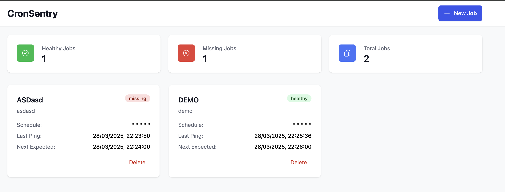

# OpenSentry

[](https://github.com/zigamedved/OpenSentry/actions/workflows/ci.yml)

Project is still a prototype and not production ready yet, so keep that in mind.

OpenSentry is a lightweight, reliable monitoring service for your cron jobs and scheduled tasks. Get notified immediately when your scheduled jobs fail to run on time.

The Go module and Docker app live in [`cronsentry/`](cronsentry/). That directory name is the original package path and is kept so existing clones and Compose files keep working. The product name is OpenSentry.

## Features

- **Simple Ping System**: Just add a simple curl command to your cron job
- **Flexible Alert Thresholds**: Set custom grace periods for each job
- **Email Notifications**: Get notified when jobs fail to run (SendGrid when configured; otherwise dry-run)
- **Status Dashboard**: View the health of all your jobs in one place
- **Slack and Discord**: Incoming webhooks for miss and recovery alerts
- **Authentication**: Authentication via TBD // In progress

## Dashboard



### Ping System Architecture

1. **User-side Integration**:
   - Register a job in OpenSentry to get a unique job ID
   - Add an HTTP POST to the end of your cron job command:
     ```
     curl -s -X POST http://your-opensentry-host:8080/api/ping/YOUR_JOB_ID
     ```
   - This curl command sends a "heartbeat" to OpenSentry after your job completes successfully
   - Treat the job ID as a secret. Anyone who has it can record a ping.

2. **Server-side Monitoring**:
   - When a ping is received, OpenSentry updates the job's status to "healthy"
   - A background service runs every 10 seconds to check for missing jobs
   - If a job misses its expected ping time plus its grace period, its status changes to "missing"
   - Missing jobs trigger notifications based on your settings

3. **Job Status Lifecycle**:
   - **Healthy**: Job is running on schedule
   - **Missing**: No ping received when expected
   - **Paused**: Monitoring temporarily disabled

This design is lightweight and effective because it requires no agent installation on your servers — just a curl command added to your existing cron jobs.

## API Usage

### Create a Job

Sign in with email and password. `POST /api/register` and `POST /api/login` return a session token and set an `opensentry_session` cookie. Send that token as `Authorization: Bearer` on management routes, or rely on the cookie from the dashboard. `POST /api/logout` ends the session. `GET /api/me` returns the signed-in user. Ping routes do not require a session.

```bash
curl -c cookies.txt -X POST http://localhost:8080/api/login \
  -H "Content-Type: application/json" \
  -d '{"email":"you@example.com","password":"your-password"}'

curl -X POST http://localhost:8080/api/jobs \
  -b cookies.txt \
  -H "Content-Type: application/json" \
  -d '{
    "name": "Database Backup",
    "description": "Daily database backup job",
    "schedule": "0 0 * * *",
    "grace_time": 15
  }'
```

### Ping a Job

Pings are HTTP **POST** requests. A GET does not record a heartbeat.

```bash
curl -X POST http://localhost:8080/api/ping/YOUR_JOB_ID
```

## Quick Start

### Using Docker Compose

1. Clone the repository:

   ```
   git clone https://github.com/zigamedved/OpenSentry.git
   cd OpenSentry/cronsentry
   ```

2. Start the application:

   ```
   docker compose up -d --build
   ```

3. Open the dashboard at http://localhost:3000 (the API listens on http://localhost:8080) and create an account. Each account sees only its own jobs. Each job card shows a copyable `POST` curl. The job id in that URL is a secret.

4. Run the copied ping (or the example below). Refresh the dashboard. The job's last ping time updates and the status stays healthy.

The Compose UI is nginx on port 3000. It proxies `/api` to the API container, and the frontend calls that same-origin path. `VITE_API_URL` is a **build** argument (Vite inlines it). Leave it empty.

The dashboard signs in with the `opensentry_session` cookie. Browsers only send that cookie to the same origin, and the API responds with `Access-Control-Allow-Origin: *` without credentials. A cross-origin `VITE_API_URL` will not receive the session cookie, so keep the dashboard and the API on one origin (nginx in Compose, the Vite proxy in local dev).

### Local Go and Vite

See [CONTRIBUTING.md](CONTRIBUTING.md). The dev dashboard is http://localhost:5173 and proxies `/api` to http://localhost:8080.

## Configuration

The API reads these environment variables. Compose sets the database values shown below.

| Variable | Default | Purpose |
| --- | --- | --- |
| `DB_HOST` | `localhost` | Postgres host |
| `DB_PORT` | `5432` | Postgres port |
| `DB_USER` | `postgres` | Postgres user |
| `DB_PASSWORD` | `postgres` | Postgres password |
| `DB_NAME` | `cronsentry` | Database name |
| `DB_SSLMODE` | `disable` | lib/pq SSL mode. Use `require` for hosted Postgres. |
| `PORT` | `8080` | API listen port |
| `DEMO_SEED` | unset | When `true`, create `test@example.com` / `opensentry-demo` if that email is missing, and attach the Slack and Discord env webhooks to that user. |
| `SENDGRID_API_KEY` | unset | When set, missing-job email is sent through SendGrid. When unset, the API logs `would send` and marks the notification `skipped`. |
| `EMAIL_FROM` | `OpenSentry <noreply@localhost>` | SendGrid from address. Use a verified sender, for example `OpenSentry <alerts@yourdomain>`. |
| `DASHBOARD_URL` | unset | Link included in alerts. Compose defaults this to `http://localhost:3000`. |
| `SLACK_WEBHOOK_URL` | unset | Slack incoming webhook for the self-host user. Saved on startup when set. |
| `DISCORD_WEBHOOK_URL` | unset | Discord webhook for the self-host user. Saved on startup when set. |

`GET /healthz` returns 200 when the API can ping Postgres. It does not require a session.

Accounts use email and password. Passwords are stored as bcrypt hashes and are never returned in JSON. A session is an opaque token stored only as a SHA-256 hash, valid for 14 days, sent as the `opensentry_session` cookie and as a bearer token. There is no shared `API_TOKEN`. `POST /api/logout` does not require a live session: it deletes the token when one matches and always expires the cookie.

Jobs created before accounts belong to `test-user` (`test@example.com`) and stay hidden from accounts you register later. Set `DEMO_SEED=true` and restart once to sign in as that user, or create a new account and new jobs. If `test@example.com` is already in the database, `DEMO_SEED` leaves its password unchanged (the old seed password was `secret`). A missing email is created as `opensentry-demo`.

Compose does not configure an email provider. A missing `SENDGRID_API_KEY` is safe: alerts are logged and marked skipped, not failed. Create a SendGrid API key, verify the `EMAIL_FROM` sender, and set `SENDGRID_API_KEY` when you want real mail.

## Slack and Discord

Miss and recovery alerts go to every channel configured for the user: email, plus Slack and Discord when a webhook is saved. A delivery failure is stored on that notification and does not stop the checker or the other channels.

Paste the webhook in the dashboard (Alert channels) while signed in. `SLACK_WEBHOOK_URL` / `DISCORD_WEBHOOK_URL` are stored for the demo user only when `DEMO_SEED=true`. An empty env var does not erase a URL saved in the dashboard. `PUT /api/channels/slack` or `PUT /api/channels/discord` with `{"webhook_url":""}` clears a channel. These routes require a session.

Create a Slack incoming webhook in your workspace's app settings, or a Discord channel webhook (Integrations → Webhooks → New Webhook). OpenSentry posts JSON:

Slack:

```json
{"text":"OpenSentry: Job 'Nightly backup' has missed its scheduled run time\nJob: Nightly backup\nWhen: Tue, 07 Oct 2026 12:00:00 UTC\nDashboard: https://monitor.example"}
```

Discord:

```json
{"content":"OpenSentry: Job 'Nightly backup' has missed its scheduled run time\nJob: Nightly backup\nWhen: Tue, 07 Oct 2026 12:00:00 UTC\nDashboard: https://monitor.example"}
```

## License

OpenSentry is released under the [MIT License](LICENSE). You may use, modify, and ship it, including as a commercial hosted service, as long as the copyright notice and this license are included with the software.

## Contributing

Contributions are welcome. See [CONTRIBUTING.md](CONTRIBUTING.md).
